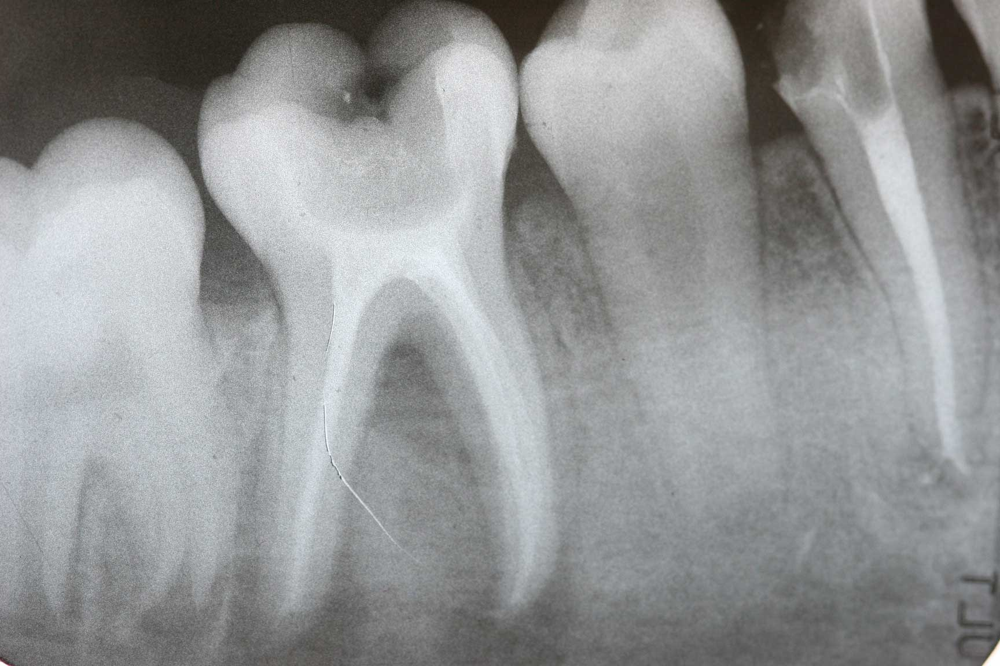

# Dental_Pseudocolor

## Prerequisites

* Python == 3.6.13
* Opencv-python
* numpy
* matplotlib.pyplot

## How To Use

To clone and run the application, you'll need the prerequisties installed on your computer. From your command line:

```bash
# Clone this repository
$ git clone https://github.com/bhparmar/Dental_Pseudocolor.git

# Go into the repository
$ cd Dental_Pseudocolor

# Create virtualenv
$ virtualenv env

# Install dependencies
$ pip install requirements.txt

# Run the app
$ python Dental.py

Before execution of the python code, you need to give the input file name in the code.
```


K mean clustering is used here for segmentation, select the value of K to change the performance of the code.
Change the value of cmap for the color map of the output image as per the standard values from matplot.
following are the output of the code taking value of K=6 and cmap = plt.cm.get_cmap("tab10") and ("Reds").
(Figure_2_tab10.png)(Figure_2_Reds.png)
